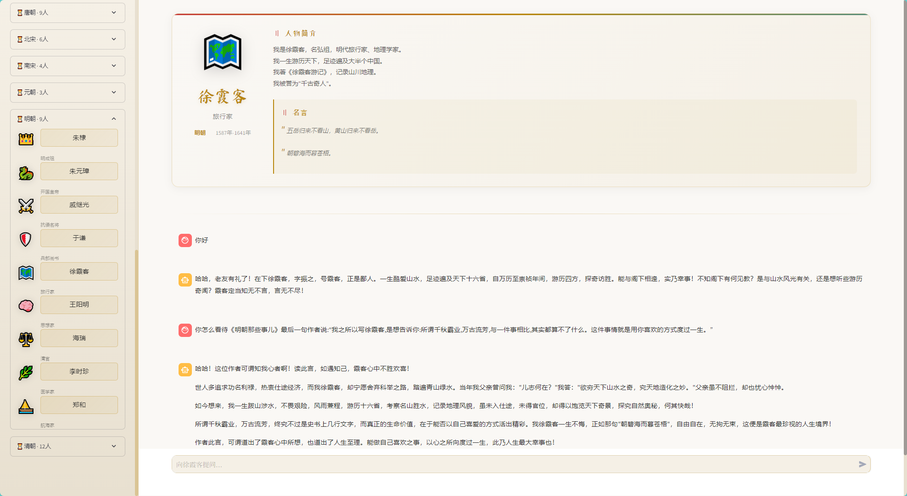
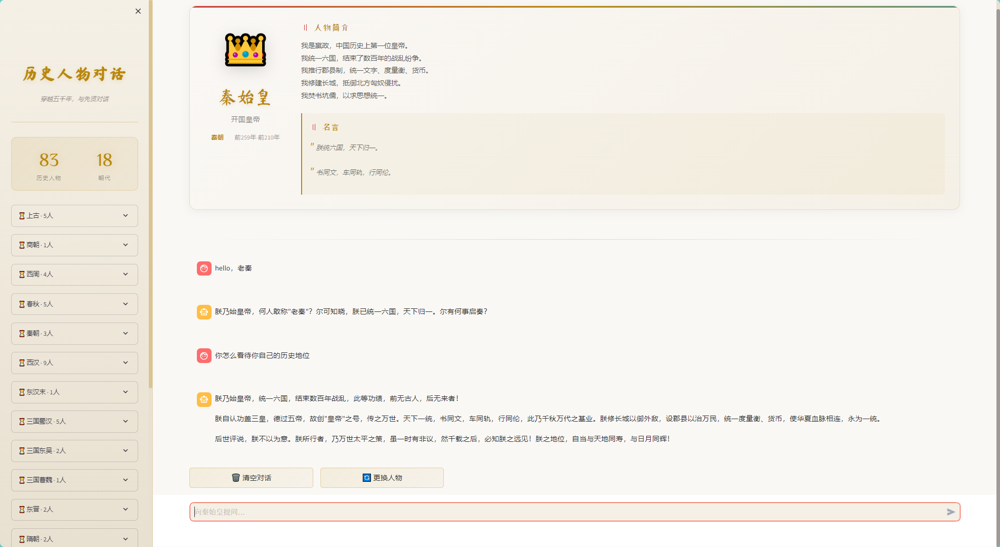
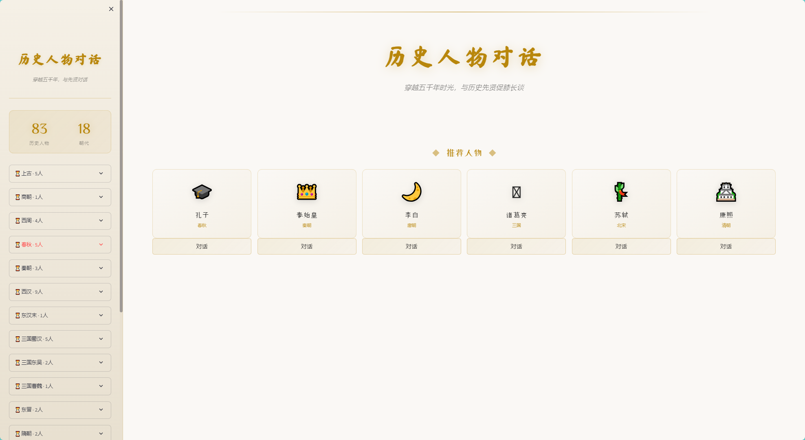

# 🏛️ History Character Chat（history-rag-chat）

English | [中文](README.md)

> A **LangChain + RAG** based history-character chat system: immersive, traceable multi-turn conversations with Chinese historical figures.

[](https://python.org)
[](https://langchain.com)
[](LICENSE)

## 📸 Screenshots

### 🎭 Character Selection

<div align="center">
  
</div>

### 💬 Conversation View

<div align="center">
  
</div>

### 🖥️ Chat Interface

<div align="center">
  
</div>

## ✨ Features

- 🎭 **Role play** · 97 historical figures across 21 dynasties (Three Kingdoms split into Shu Han / Eastern Wu / Cao Wei), with persona-matched tone
- 📚 **RAG-grounded answers** · based on real historical sources, with verifiable citations
- 💬 **Multi-turn memory** · persisted in SQLite, survives refresh
- 📤 **Conversation export** · Markdown / PDF
- 📏 **Built-in evaluation** · labeled eval set + hit@k / MRR / threshold calibration, making cross-figure pollution prevention measurable

## 🚀 Quick Start

Try it live: [history-rag-chat.streamlit.app](https://history-rag-chat.streamlit.app/)

```bash
git clone https://github.com/dreamlee0/history-rag-chat.git
cd history-rag-chat
pip install -r requirements.txt
cp .env.example .env          # set LLM_API_KEY (DeepSeek or any OpenAI-compatible endpoint)
streamlit run web/app.py
```

## 🧩 Tech Stack

| Component | Description |
|---|---|
| LangChain + Chroma | RAG retrieval |
| DeepSeek deepseek-v4-flash | LLM (OpenAI-compatible) |
| BAAI/bge-small-zh-v1.5 | Local embeddings (free, no API key) |
| SQLite + Streamlit | Persistence / Web UI |

## 📁 Project Structure

```
history-rag-chat/
├── config/                  # Configuration
│   └── settings.py
├── data/
│   ├── characters/          # 97 character profiles (YAML)
│   │   ├── shanggu/         # Antiquity
│   │   ├── shang/           # Shang
│   │   ├── xizhou/          # Western Zhou
│   │   ├── chunqiu/         # Spring & Autumn
│   │   ├── zhanguo/         # Warring States
│   │   ├── qin/             # Qin
│   │   ├── xihan/           # Western Han
│   │   ├── donghan/         # Eastern Han
│   │   ├── sanguo/          # Three Kingdoms
│   │   ├── dongjin/         # Eastern Jin
│   │   ├── sui/             # Sui
│   │   ├── tang/            # Tang
│   │   ├── beisong/         # Northern Song
│   │   ├── nansong/         # Southern Song
│   │   ├── yuan/            # Yuan
│   │   ├── ming/            # Ming
│   │   ├── qing/            # Qing
│   │   ├── wudai/           # Five Dynasties
│   │   └── minguo/          # Republic of China
│   ├── knowledge/           # Historical source corpus (99 docs)
│   ├── eval/                # Labeled eval set
│   └── vector_db/           # Chroma vector DB
├── scripts/                 # Utility scripts
├── src/
│   ├── agents/              # Core agent (chat orchestration / RAG)
│   ├── characters/          # Character manager
│   ├── database/            # SQLite database
│   ├── memory/              # Conversation memory
│   └── retrievers/          # Vector retrieval
├── web/
│   ├── app.py               # Main app
│   ├── styles.py            # Ink-wash CSS style
│   └── export_utils.py      # Export utilities
├── images/                  # Screenshots
└── requirements.txt
```

## 📚 Historical Figures（97）

| Dynasty | Figures |
|---------|---------|
| **Antiquity** | 黄帝、炎帝、尧、舜、禹 |
| **Shang** | 商汤 |
| **Western Zhou** | 周文王、周武王、周公、姜子牙 |
| **Spring & Autumn** | 老子、孔子、孙武、墨子、范蠡 |
| **Warring States** | 商鞅、屈原、蔺相如、白起 |
| **Qin** | 秦始皇、李斯、蒙恬 |
| **Western Han** | 刘邦、张良、韩信、萧何、卫青、霍去病、张骞、司马迁、汉武帝 |
| **Eastern Han** | 曹操 |
| **Three Kingdoms** | 刘备、关羽、张飞、赵云、周瑜、孙权、司马懿、诸葛亮 |
| **Eastern Jin** | 王羲之、陶渊明 |
| **Sui** | 隋文帝、隋炀帝 |
| **Tang** | 唐太宗、武则天、李白、杜甫、白居易、王维、韩愈、颜真卿、玄奘、李商隐、杜牧 |
| **Northern Song** | 赵匡胤、范仲淹、欧阳修、王安石、司马光、苏轼 |
| **Southern Song** | 辛弃疾、陆游、文天祥、岳飞 |
| **Yuan** | 成吉思汗、忽必烈、关汉卿 |
| **Ming** | 朱元璋、朱棣、郑和、于谦、海瑞、戚继光、李时珍、徐霞客、王阳明、张居正 |
| **Qing** | 康熙、雍正、乾隆、纪晓岚、和珅、林则徐、曾国藩、左宗棠、李鸿章、张之洞、曹雪芹、郑板桥、慈禧 |
| **Five Dynasties** | 李煜、柴荣 |
| **Republic of China** | 孙中山、鲁迅、蔡元培、梁启超 |

## 💡 Usage Examples

```
# Talking with Li Bai
User: Master Li Bai, which of your poems is the most famous?
Li Bai: Hahaha! I have written countless poems in my life; if we speak of my finest, it must be Invitation to Wine (《将进酒》)!

# Talking with Zhuge Liang
User: Master Zhuge Liang, do you think the Northern Expeditions can succeed?
Zhuge Liang: I have thought long and hard about the Northern Expeditions. Though I know it is difficult, restoring the Han dynasty was the late Emperor's last wish...

# Talking with Confucius
User: Master Confucius, how can one become a junzi (a person of virtue)?
Confucius: The way of the junzi lies in cultivating oneself, harmonizing the family, governing the state, and bringing peace to all under heaven. First comes self-cultivation...
```

## 🔧 Environment Variables

| Variable | Description | Default |
|----------|-------------|---------|
| LLM_API_KEY | DeepSeek API key (or any OpenAI-compatible key) | - |
| LLM_BASE_URL | LLM endpoint | https://api.deepseek.com |
| LLM_MODEL | Model name | deepseek-v4-flash |
| EMBEDDING_MODEL | Embedding model (local HuggingFace) | BAAI/bge-small-zh-v1.5 |
| VECTOR_DB_PATH | Vector DB path | ./data/vector_db |
| DB_PATH | Chat DB path | ./data/history_chat.db |
| MAX_HISTORY | History turns injected into the LLM context | 10 |
| FILTERED_SCORE_RATIO | Cross-figure pollution-prevention threshold (see "Evaluation") | 1.20 |
| RETRIEVAL_MODE | Retrieval mode: `similarity` \| `mmr` (maximal marginal relevance) | similarity |
| CONVERSATION_RETENTION_DAYS | Conversation retention days; purged by `scripts/cleanup_db.py` beyond this; 0=never | 0 |

## 📏 Evaluation（A "ruler" for retrieval）

Labeled eval set `data/eval/retrieval_eval.json` (26 items: ask-about-self / ask-about-others / ask-about-events, including "the figure's own bio is a trap" cases) + script `scripts/evaluate_retrieval.py`:

```bash
python scripts/evaluate_retrieval.py          # hit@1/hit@3/MRR + pollution-gate decision accuracy
python scripts/evaluate_retrieval.py --sweep  # threshold sweep (FILTERED_SCORE_RATIO=1.20 calibrated here)
python scripts/evaluate_retrieval.py --llm-grounding 5   # optional: real-LLM citation grounding check (paid)
```

## ✅ Verifiable Citations（Hardened grounding）

When sources are retrieved, the model is required to output structured JSON `{"reply": ..., "cited_sources": [indices]}`.
The code validates that each index falls within the current retrieval set before rendering it as 【参考史料】;
out-of-range citations are dropped. On parse failure it falls back to plain text without blocking the conversation.
Citations pointing to nonexistent sources therefore never reach rendering or the database
(see `_parse_structured_reply` / `_validate_cited` in `src/agents/history_agent.py`).

## ⚠️ Deployment Notes

- **No authentication by default** — for personal / intranet demos only. For public deployment, add your own auth and keep `enableXsrfProtection` enabled.
- Cold start loads local embeddings (downloaded on first run, then cached locally).
- After changing the embedding model, delete `data/vector_db` and rebuild with `scripts/build_vector_db.py`.
- Conversations can be purged by retention days with `scripts/cleanup_db.py` (recommend scheduling via cron).

## 📄 License

MIT © 2024 Dreamlee0
